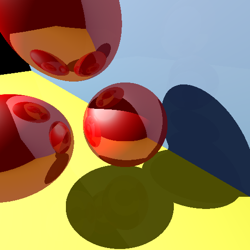
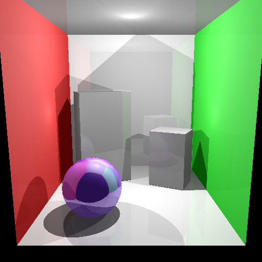
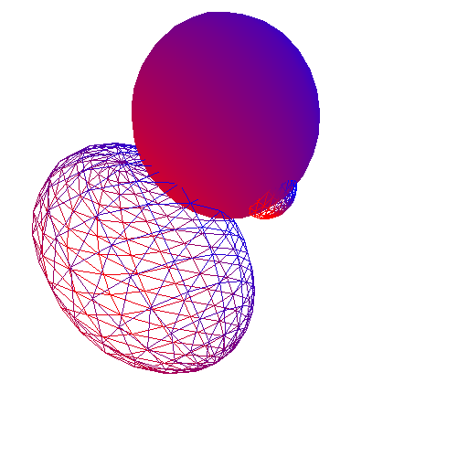
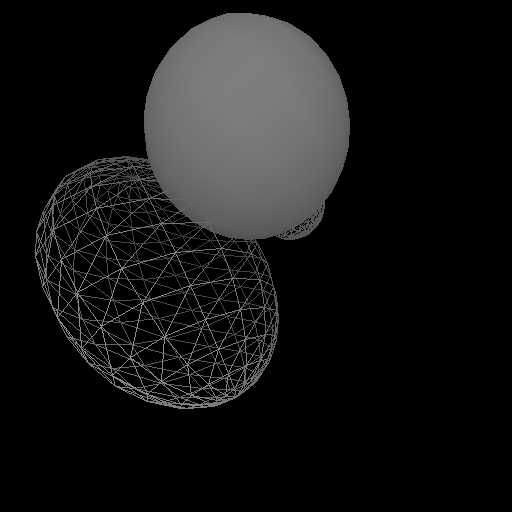
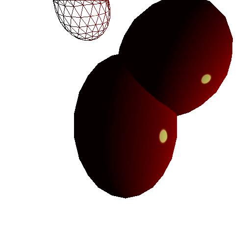

# 项目描述

这个项目用于实践在《Fundamentals of Computer Graphics 3rd》中学习的图形知识。

主要包含前期一个简单的Ray Tracing渲染以及后来的光栅化渲染。

## RayTracing效果图

## 光栅化效果图

## 运行项目

TestCasesInSuits项目中主要是一些测试代码，一些测试代码运行之后会自动显示图像，用鼠标中间点击即可关闭，然后运行接下来的测试代码。  
这个项目要用到额外的库，请下载[MyLibrary_of_C_Cplusplus](https://github.com/181847/MyLibrary_of_C_Cplusplus)，用CMake编译之后，在本项目的CMake配置界面中要配置**MY_LIBRARY_PATH**的路径为上面这个Repo的本地路径即可。
